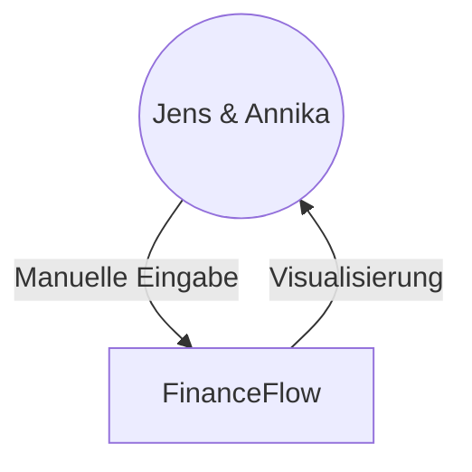

# 3. System Scope and Context

## 3.1 Business Context
FinanceFlow is a standalone application. It does not automatically fetch data from banks (for privacy and simplicity). Users manually enter their current balances.

## 3.2 Technical Context
The application runs as a web service on the local machine.

| Interface | Description |
|---|---|
| Web UI | React-based frontend running in Safari. |
| REST API | FastAPI-based backend providing CRUD operations for records, institutes, and categories. |
| File System | Local `data.json` storage. |
