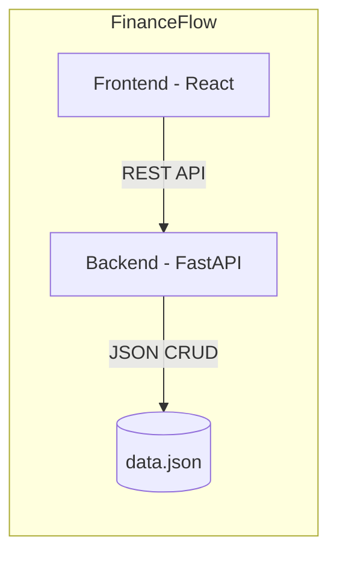

# 5. Building Block View

## 5.1 Level 1: Whitebox System Overall

### 5.1.1 Frontend (React)
Contains the UI logic, state management (Zustand), and data visualization (Recharts).

### 5.1.2 Backend (FastAPI)
Handles request validation, business logic (sorting/filtering), and disk I/O for the JSON database.

### 5.1.3 Storage (JSON)
Flat file containing `records`, `institutes`, and `categories`.

## 5.2 Level 2: Component Breakdown
| Component | Responsibility |
|---|---|
| `App.jsx` | Main UI container, dashboard logic, and tab management. |
| `store.js` | State synchronization between Frontend and Backend. |
| `api.js` | Abstracted API communication layer. |
| `main.py` | FastAPI application, routing, and static file serving. |
| `models.py` | Data structure definitions (Pydantic). |
