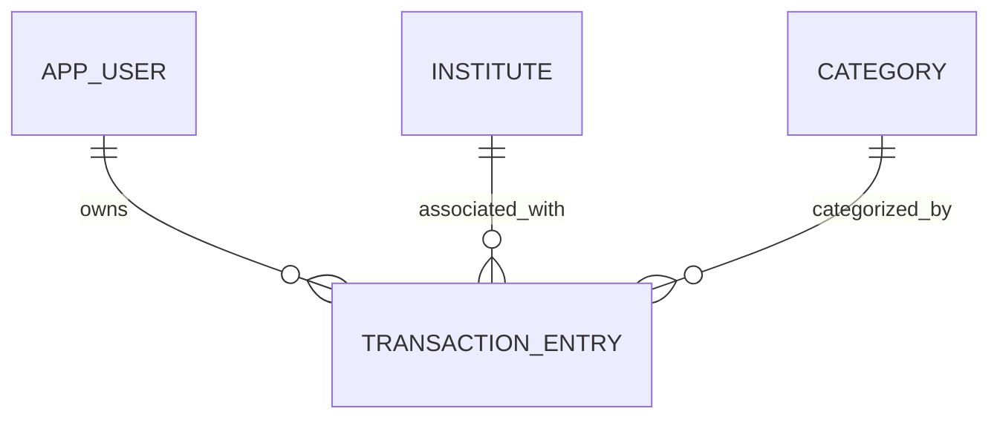

# Entity Model

## Entity Relationship Diagram

### APP_USER

Represents a user of the finance application.

| Attribute | Description | Data Type | Length/Precision | Validation Rules |
|-----------|-------------|-----------|------------------|------------------|
| id        | Unique identifier | Long      | 19               | Primary Key, Sequence |
| username  | Name of the user (e.g. Jens, Annika) | String    | 50               | Not Null, Unique |

### INSTITUTE

Represents a financial institution or bank.

| Attribute | Description | Data Type | Length/Precision | Validation Rules |
|-----------|-------------|-----------|------------------|------------------|
| id        | Unique identifier | Long      | 19               | Primary Key, Sequence |
| name      | Name of the institute (e.g. Trade Republic, Sparkasse) | String    | 100              | Not Null, Unique |

### CATEGORY

Represents a category of financial asset or transaction type.

| Attribute | Description | Data Type | Length/Precision | Validation Rules |
|-----------|-------------|-----------|------------------|------------------|
| id        | Unique identifier | Long      | 19               | Primary Key, Sequence |
| name      | Name of the category (e.g. Krypto, ETF, Girokonto) | String    | 100              | Not Null, Unique |

### TRANSACTION_ENTRY

Represents a recorded financial entry for a specific user, institute, and category at a given date.

| Attribute    | Description | Data Type | Length/Precision | Validation Rules |
|--------------|-------------|-----------|------------------|------------------|
| id           | Unique identifier | Long      | 19               | Primary Key, Sequence |
| user_id      | Foreign key referencing APP_USER | Long      | 19               | Not Null, Foreign Key |
| institute_id | Foreign key referencing INSTITUTE | Long      | 19               | Not Null, Foreign Key |
| category_id  | Foreign key referencing CATEGORY | Long      | 19               | Not Null, Foreign Key |
| amount       | Value of the financial entry | Decimal   | 15,2             | Not Null |
| entry_date   | The date this entry represents | Date      | -                | Not Null |
